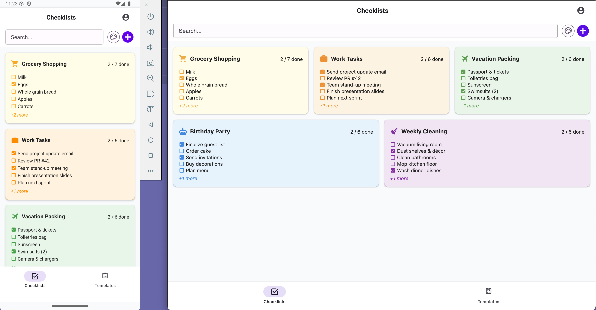
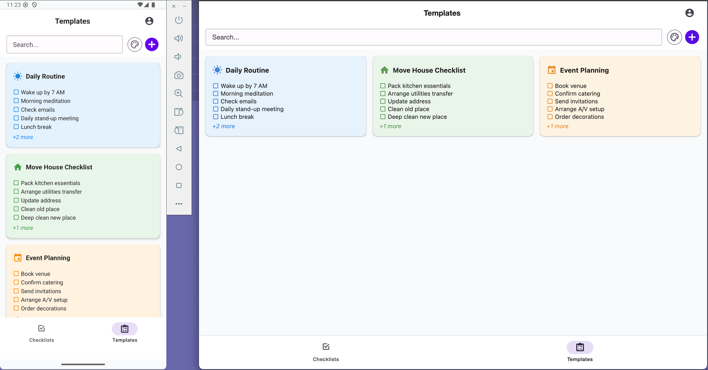
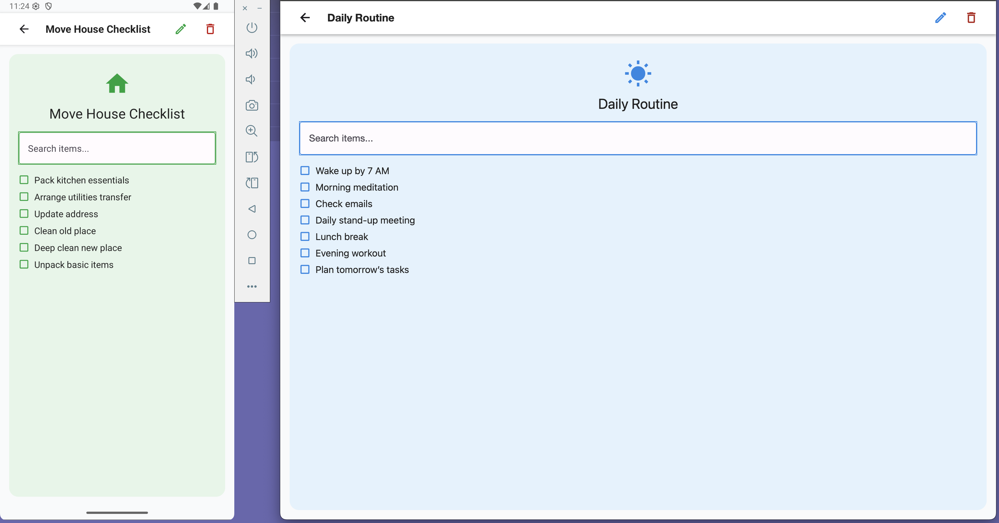
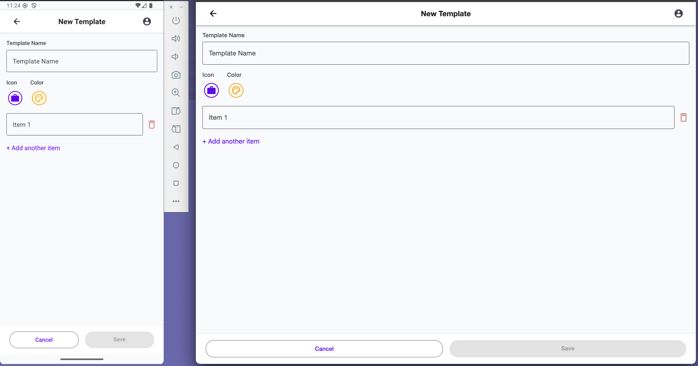
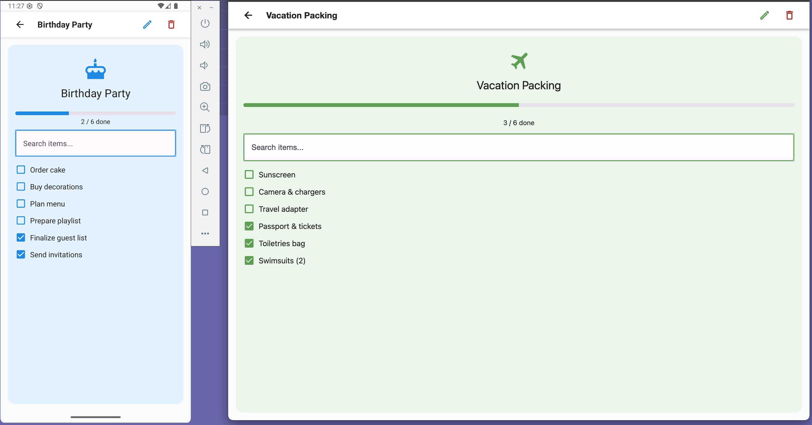

# Checklist App

A checklist app built with React Native, Expo, and React Native Paper. Users can create and reuse checklist templates, manage multiple checklists, and track completion progress.

## Table of Contents

- [Features](#features)
- [Screenshots](#screenshots)
- [Tech Stack](#tech-stack)
- [Getting Started](#getting-started)
  - [Prerequisites](#prerequisites)
  - [Installation](#installation)
  - [Running in Development](#running-in-development)
- [Building for Production](#building-for-production)
  - [Android (.apk/.aab)](#android-apk-aab)
  - [iOS (.ipa)](#ios-ipa)
- [File Structure](#file-structure)
- [Contributing](#contributing)
- [License](#license)

## Features

- Create, edit, and delete checklist templates
- Instantiate checklists from templates on the fly
- Mark items complete and view progress (e.g. `3 / 7 done`)
- Filter templates and checklists by color and text
- Responsive layout: single column on mobile, multi-column on tablet/web
- Persist data locally (AsyncStorage)

## Screenshots

- **Home / Checklists**
  
- **Templates List**
  
- **View Template**
  
- **Create / Edit Template**
  
- **View & Complete Checklist**
  

## Tech Stack

- **React Native** (via [Expo](https://expo.dev))
- **Expo Router** for file-based routing
- **React Native Paper** for UI components
- **@expo/vector-icons** (MaterialCommunityIcons)
- **react-native-get-random-values** + `uuid` for IDs
- **AsyncStorage** (via context) for local persistence
- **Reanimated** for optional animations

## Getting Started

### Prerequisites

- **Node.js** >= 16
- **Yarn** or **npm**
- **Expo CLI**: `npm install -g expo-cli`
- **Android SDK** (set `ANDROID_HOME`)
- **Xcode** (macOS, for iOS simulator / builds)

### Installation

```bash
git clone https://github.com/kansalanmol0609/mobile-checklist-app.git
cd mobile-checklist-app
npm install # or yarn install
```

### Running in Development

- **Expo Go** (fast reload, no native build):

  ```bash
  expo start
  ```

  Scan the QR code with Expo Go on your device.

- **Local native build**:
  ```bash
  expo run:android
  expo run:ios
  ```

## Building for Production

### Android (.apk/.aab)

- **Cloud build** (EAS):
  ```bash
  eas build --platform android
  ```
- **Local AAB→APK** (bundletool):
  ```bash
  eas build --platform android --local --profile preview
  ```

### iOS (.ipa)

- **Cloud build** (EAS):
  ```bash
  eas build --platform ios
  ```
- **Xcode archive**:
  1. Open `ios/YourApp.xcworkspace` in Xcode.
  2. Product → Archive → Distribute App.

## File Structure

```
/mobile-checklist-app
├── app/                   # Expo Router screens
│   ├── index.tsx          # Home (Checklists)
│   ├── checklist/         # Checklist view
│   └── checklist-template/
│       ├── create.tsx     # New template
│       ├── [id].tsx       # View template
│       └── [id]/edit.tsx  # Edit template
├── components/            # Reusable UI components
│   ├── Header.tsx
│   ├── FilterBar.tsx
│   ├── ColorPicker.tsx
│   ├── IconPicker.tsx
│   └── TemplatePicker.tsx
├── contexts/              # React context for data
├── constants/             # Color schemes, icons, etc.
├── types/                 # TypeScript types
├── assets/                # Images and fonts
├── ios/                   # iOS native project
├── android/               # Android native project
├── README.md              # Project overview and instructions
└── eas.json               # EAS build configuration
```

## Contributing

1. Fork the repo
2. Create a feature branch: `git checkout -b feat/xyz`
3. Commit your changes: `git commit -m "feat: add xyz"`
4. Push: `git push origin feat/xyz`
5. Open a Pull Request

## License

MIT © Anmol Kansal
