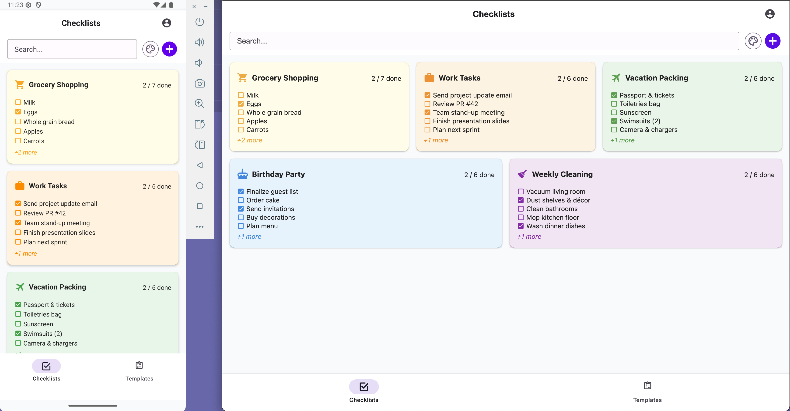
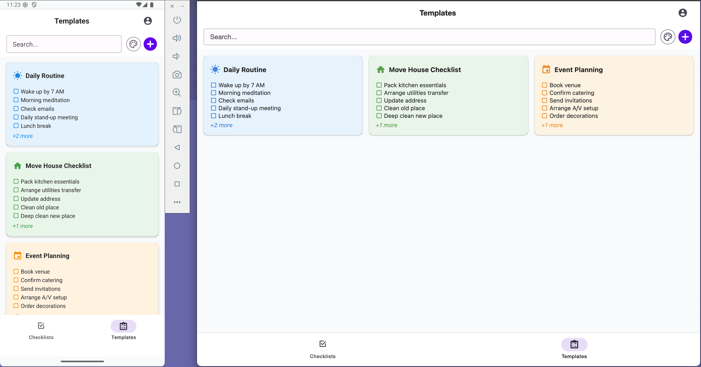
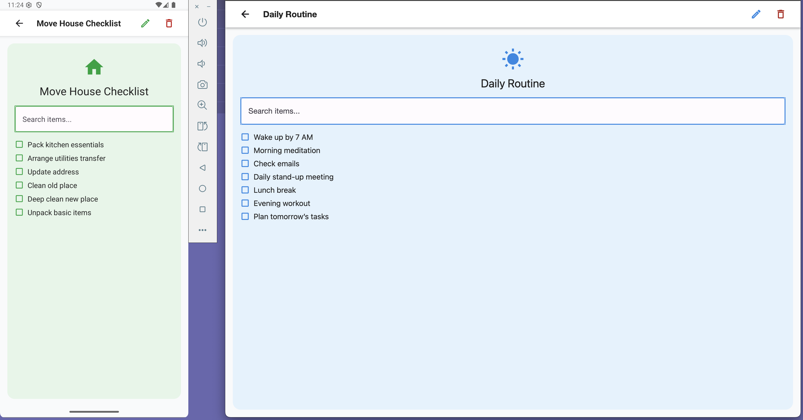
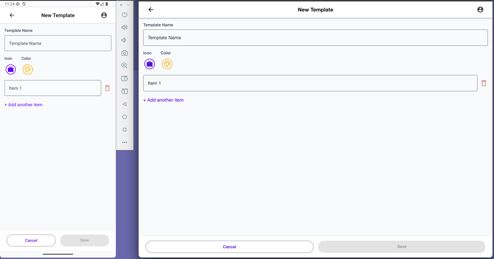
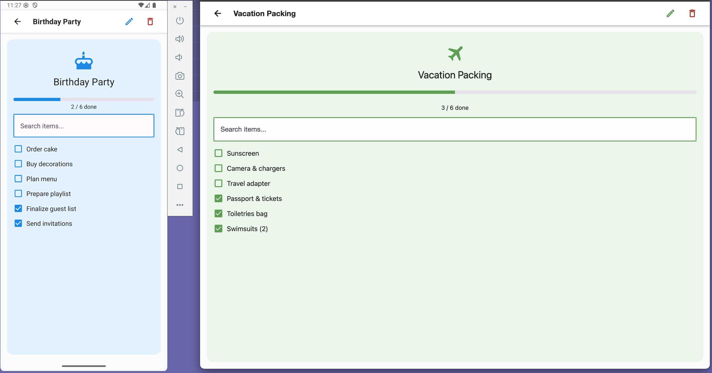

# Checklist App Monorepo

A monorepo containing both the **mobile app** (React Native/Expo) and the **backend API** (Node.js/Express). This structure allows for easier development, deployment, and contribution across both codebases.

## Table of Contents

- [Monorepo Structure](#monorepo-structure)
- [Features](#features)
- [Screenshots](#screenshots)
- [Tech Stack](#tech-stack)
- [Getting Started](#getting-started)
  - [Prerequisites](#prerequisites)
  - [Installation](#installation)
  - [Running the Mobile App](#running-the-mobile-app)
  - [Running the Backend API](#running-the-backend-api)
- [Building for Production](#building-for-production)
  - [Mobile App](#mobile-app)
  - [Backend API](#backend-api)
- [File Structure](#file-structure)
- [Contributing](#contributing)
- [License](#license)

## Monorepo Structure

```
/checklist-app
├── backend/      # Node.js/Express backend API
├── mobile/       # React Native (Expo) mobile app
├── README.md     # Monorepo overview (this file)
└── ...           # Root configs, etc.
```

## Features

- Mobile: Create, edit, and delete checklist templates
- Mobile: Instantiate checklists from templates on the fly
- Mobile: Mark items complete and view progress (e.g. `3 / 7 done`)
- Mobile: Filter templates and checklists by color and text
- Mobile: Responsive layout (single column on mobile, multi-column on tablet/web)
- Mobile: Persist data locally (AsyncStorage)
- Backend: REST API for checklist data (WIP)

## Screenshots (Mobile)

- **Home / Checklists**
  
- **Templates List**
  
- **View Template**
  
- **Create / Edit Template**
  
- **View & Complete Checklist**
  

## Tech Stack

- **Mobile:**
  - React Native (Expo)
  - Expo Router (file-based routing)
  - React Native Paper (UI components)
  - @expo/vector-icons (MaterialCommunityIcons)
  - AsyncStorage (via context) for local persistence
  - Reanimated (optional animations)
- **Backend:**
  - Node.js
  - Express
  - TypeScript
  - MongoDB (planned)

## Getting Started

### Prerequisites

- **Node.js** >= 16
- **Yarn** or **npm**
- **Expo CLI**: `npm install -g expo-cli` (for mobile)
- **Android SDK** (for Android builds)
- **Xcode** (macOS, for iOS builds)

### Installation

Clone the repo and install dependencies for both projects:

```bash
git clone https://github.com/kansalanmol0609/mobile-checklist-app.git
cd mobile-checklist-app
# Install root dependencies (if any)
# Install mobile dependencies
cd mobile
npm install # or yarn install
# Install backend dependencies
cd ../backend
npm install # or yarn install
```

### Running the Mobile App

- **Expo Go** (fast reload, no native build):

  ```bash
  cd mobile
  expo start
  ```

  Scan the QR code with Expo Go on your device.

- **Local native build**:
  ```bash
  expo run:android
  expo run:ios
  ```

### Running the Backend API

```bash
cd backend
npm run dev
```

The backend will start on the configured port (see backend/README.md for details).

## Building for Production

### Mobile App

- **Android (.apk/.aab)**
  - Cloud build (EAS):
    ```bash
    eas build --platform android
    ```
  - Local AAB→APK (bundletool):
    ```bash
    eas build --platform android --local --profile preview
    ```
- **iOS (.ipa)**
  - Cloud build (EAS):
    ```bash
    eas build --platform ios
    ```
  - Xcode archive:
    1. Open `ios/YourApp.xcworkspace` in Xcode.
    2. Product → Archive → Distribute App.

### Backend API

- Build and run production server:
  ```bash
  cd backend
  npm run build
  npm start
  ```

## File Structure

```
/checklist-app
├── backend/
│   ├── src/            # Express API source code
│   ├── models/         # Database models
│   ├── routes/         # API routes
│   ├── middleware/     # Express middleware
│   ├── package.json
│   └── ...
├── mobile/
│   ├── app/            # Expo Router screens
│   ├── components/     # Reusable UI components
│   ├── contexts/       # React context for data
│   ├── constants/      # Color schemes, icons, etc.
│   ├── assets/         # Images and fonts
│   ├── types.ts        # TypeScript types
│   ├── utils/          # Utility functions
│   ├── package.json
│   └── ...
├── README.md           # Monorepo overview
└── ...                 # Root configs, etc.
```

## Contributing

1. Fork the repo
2. Create a feature branch: `git checkout -b feat/xyz`
3. Commit your changes: `git commit -m "feat: add xyz"`
4. Push: `git push origin feat/xyz`
5. Open a Pull Request

## License

MIT © Anmol Kansal
